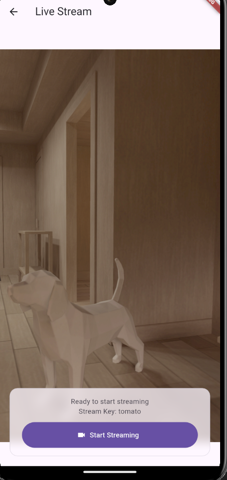
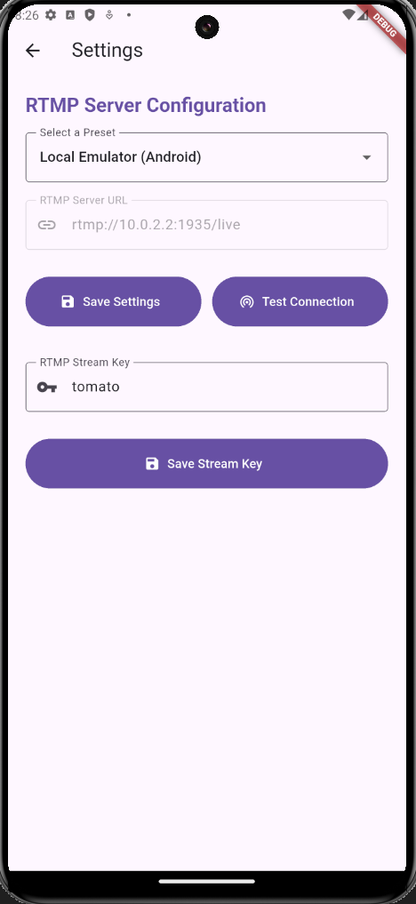
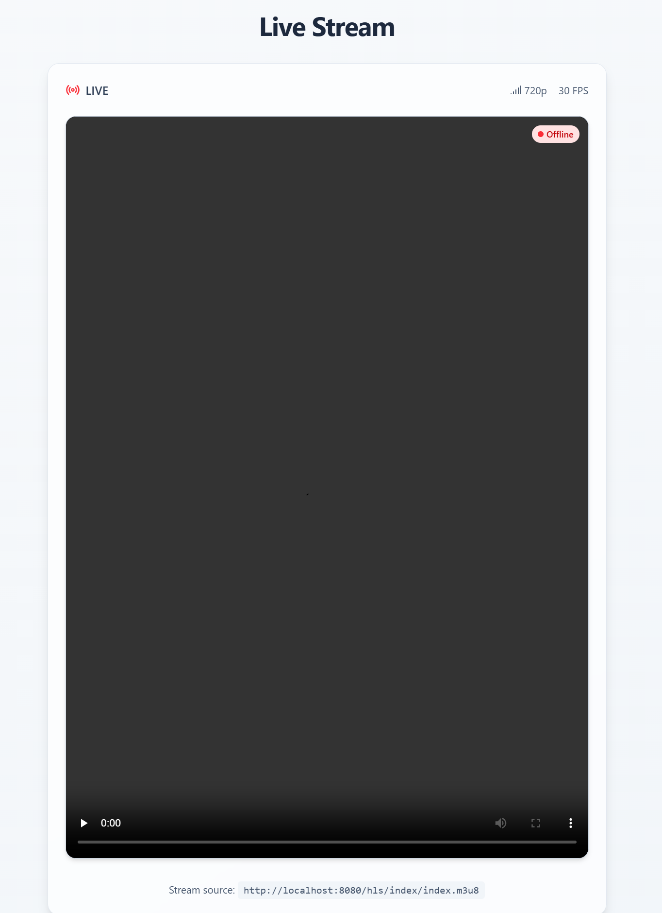

# flutter_video_stream

## Beskrivning

Detta projekt består av en Flutter-applikation som kan ta kamera-feeden från en mobil, strömma den till en server som sedan skickar vidare den till en hemsida gjord i NextJS där den visas upp.
Projektet ligger fördelat i 3 repositories:

- [Flutter-applikation](https://github.com/Screenbottle/flutter_video_stream)
- [NextJS-hemsida](https://github.com/Screenbottle/flutter-video-stream-website)
- [Server](https://github.com/Screenbottle/rtmp-server)

## Innehållsförteckning

- [Funktionalitet](#funktionalitet)
- [Teknologier](#teknologier)
- [Skärmdumpar](#skärmdumpar)
- [Installation](#installation)
- [Arbetsflöde](#arbetsflöde)
- [Sprint Planning](#sprint-planning)
- [Användning](#användning)
- [Bidra](#bidra)
- [Lärdomar](#lärdomar)
- [Licens](#licens)

## Funktionalitet

- **Flutter-applikation:** Tar kamera-feeden och skickar den till en IP-adress (servern). Det går att ställa in en egen IP-adress samt en egen stream key vid behov.
- **Server:** En Nginx-server som tar emot strömmen och gör den tillgänglig för anrop från t.ex en hemsida.
- **Hemsida:** En hemsida byggd i NextJS som anropar servern, visar alla aktiva strömmar för användaren.

## Teknologier

- Flutter
- [apivideo_live_stream](https://pub.dev/packages/apivideo_live_stream)
- Docker
- Nginx
- NextJS
- Typescript
- [hls.js](https://www.npmjs.com/package/hls.js/v/0.8.5)

## Skärmdumpar:

### Flutter-applikation

|                Home                   |              Stream                       |                  Settings                |
| :-----------------------------------: | :---------------------------------------: | :--------------------------------------: |
|  |  |  |

### NextJS-hemsida

|                Stream                |
| :----------------------------------: |
|  |

## Installation

1.  **Klona repositories:**

    ```bash
    git clone https://github.com/Screenbottle/flutter_video_stream
    git clone https://github.com/Screenbottle/flutter-video-stream-website
    git clone https://github.com/Screenbottle/rtmp-server
    ```

2.  **Installera beroenden:**

    **Flutter**
    ```bash
    flutter pub get
    ```

    **NextJS**
    ```bash
    cd app
    npm install
    ```

3. **Starta server**
    ```bash
    docker compose up -d
    ```

    Du kan behöva sätta upp port forwarding i din router för att kunna strömma via LAN beroende på hur den är inställd

4. **Kör utvecklingsmiljöer**

    **Flutter**
    ```bash
    flutter run
    ```
    Välj enhet (iOS eller Android, emulator eller fysisk enhet kopplad till datorn)

    **NextJS**
    ```bash
    npm run dev
    ```
    Öppna [http://localhost:3000](http://localhost:3000) i din webbläsare för att visa applikationen.

## Arbetsflöde

Projektet har varit ett individuellt arbete.

Arbetet har utförts i form av ett agilt projekt med SCRUM-struktur, varpå en Kanban-bräda har används för att strukturera arbetsmomenten. Projektet delades upp i veckolånga sprintar.

## Sprint Planning

Projektet utfördes under tre veckolånga sprintar.

### Sprint 1

- Grundläggande planering av projektet med kort (Kanban)
- Skapade Flutter projekt
- Val av ramverk för hantering av videoströmningen
- Första version av strömningssidan i flutter-applikationen
- Skapade Nginx-server i Docker

### Sprint 2

- Skapade NextJS projekt
- Första version av videospelare på hemsidan som visar strömmen från appen med hls.js
- Uppdatering av Flutter-applikationens utseende
- Inställningar i Flutter-applikationen, användaren kan byta vilken IP-adress de vill strömma till
- Implementerade strömning via LAN

### Sprint 3

- Implementerade strömning utanför LAN
- Användaren kan modifiera namnet på sin stream key i Flutter-applikationen, unika stream keys möjliggör flera streams samtidigt
- NextJS API-route som hämtar data om aktiva streams från servern i xml-form
- Hemsidan visar alla aktiva streams

## Användning

- **Strömma video från mobil:** Starta Flutter-appen, gå till inställningar och ställ in IP-address samt stream key. Starta din stream, den kommer sedan att visas på hemsidan
- **Se andras streams:** Gå in på hemsidan, startsidan visar alla aktiva streams

## Bidra

Contributions are welcome! Please submit a pull request with your proposed changes.

## Lärdomar

- Kamerahantering i Flutter
- Grundläggande användning av Docker 
- Konfigurering av Nginx
- Felsökning med Docker loggar
- Hantering av alternativa format i NextJS, konverting av xml till JSON, hantering av videoformatet hls

## Licens

[MIT](LICENSE)